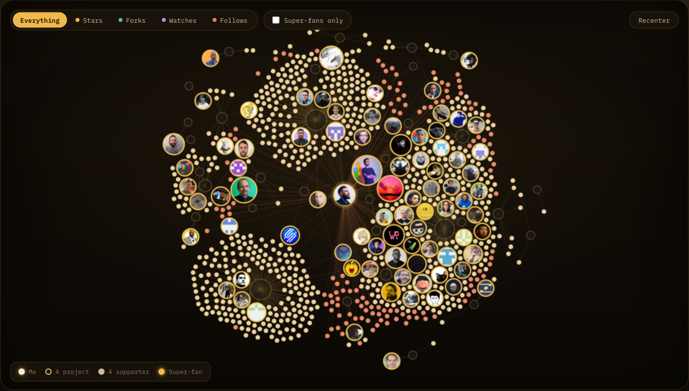

# thank you ✦

A standing thank-you to everyone who ever **starred, forked, watched or followed**
your work — rendered as a *cloud of the people behind the numbers*.

It is deliberately **not** a stats dashboard. No commit graphs, no streaks, no vanity charts.
Every node is a **human** who showed up for something you made, and every line traces their
gesture back to the work it landed on. Fork it, point it at your accounts, and you get your own.



- **Live example:** [thank-you.tamino.dev](https://thank-you.tamino.dev)
- **Sources:** GitHub (full, incl. the open source you depend on), CodePen / X / LinkedIn (via export)
- **Stack:** TypeScript collectors · a nightly GitHub Action · a zero-build static site (d3 on canvas)

---

## Make it your own

You can have your own graph live in about five minutes — no server, no database, free hosting.

1. **Fork** this repo (the green *Fork* button, top-right).

2. **Point it at you** — edit [`config.json`](config.json): set your `owner.name`, `owner.tagline`,
   `sources.github.username`, your `presence` links, and `repoUrl`. That's the only file you need
   to touch.

3. **Add the encryption key** — generate one:

   ```bash
   node -e "console.log(require('crypto').randomBytes(32).toString('hex'))"
   ```

   Add it under **Settings → Secrets and variables → Actions → New repository secret** as
   `ENCRYPTION_KEY`. *(Optional: also add `GH_PAT`, a classic token with no scopes, for a
   5,000/hr API rate limit instead of 1,000.)*

4. **Turn on Pages** — **Settings → Pages → Build and deployment → Source: GitHub Actions**.

5. **Run it** — **Actions → Sync & deploy → Run workflow**. It collects your data, encrypts the
   full snapshot, publishes the curated graph, and deploys.

6. **Done** — your page is live at `https://<your-username>.github.io/<repo>/`, and it refreshes
   itself **every night**.

> No secrets? `npm run serve` still renders the committed sample graph — fork, run, and you'll see
> *this* page before you've configured anything.

### Custom domain (optional)

To host at something like `thank-you.tamino.dev`:

1. **DNS** — add a `CNAME` record for your subdomain (`thank-you`) pointing at
   `<your-username>.github.io`. *(An apex domain like `example.com` needs `A`/`ALIAS` records
   instead — see [GitHub's guide](https://docs.github.com/pages/configuring-a-custom-domain-for-your-github-pages-site).)*
2. **config** — set `"cname": "thank-you.example.com"` in [`config.json`](config.json). The deploy
   workflow writes the `CNAME` file from this value, so forks never collide on each other's domain.
3. **GitHub** — **Settings → Pages → Custom domain**, enter the domain, **Save**. Wait for the DNS
   check to pass, then tick **Enforce HTTPS** once the certificate provisions.

Leave `cname` as `null` to stay on the default `github.io` URL.

---

## How it works

Two artifacts flow through a nightly pipeline (the technique mirrors
[`github-stats`](https://github.com/tamino-martinius/github-stats)):

```
                ┌──────────────┐   AES-256-GCM    ┌────────────────────┐
  collectors ──▶│  collect.ts  │ ───────────────▶ │ data/snapshot.enc  │  (committed, encrypted)
  (gh/cp/…)     └──────────────┘                  └────────────────────┘
                                                            │ decrypt
                                                            ▼
                                                   ┌────────────────────┐
                                                   │   aggregate.ts     │
                                                   └────────────────────┘
                                                            │ curate
                                                            ▼
                                            data/public/graph.json  +  site/data/graph.json
                                                            │
                                                            ▼
                                                   the website (d3 on canvas)
```

1. **`collect.ts`** runs every enabled collector, merges them into one people-centric `Snapshot`
   (every raw person + interaction), and writes it **encrypted** to `data/snapshot.enc`. Only the
   Action — which holds `ENCRYPTION_KEY` — can read or write it; the granular history stays private.
2. **`aggregate.ts`** decrypts that snapshot and distils the **public** graph the site reads
   (`data/public/graph.json`): people ranked by interactions, projects with supporter counts, the
   links between them, and the reciprocal "people & work I lean on" set.
3. **The site** (`site/`) is static — no build step — rendering the graph with
   [d3-force](https://d3js.org) on a `<canvas>`, plus a searchable wall of every supporter.

### What gets collected

> Only data that points back to a **person**. No anonymous aggregates.

| Source | What it reads | People you can thank |
| --- | --- | --- |
| **GitHub** | repos, stargazers (with timestamps), forkers, watchers, followers | ✅ everyone |
| **GitHub (deps)** | every repo's `package.json` → npm → the GitHub repo + maintainer | ✅ maintainers you rely on |
| **CodePen** | — (Cloudflare-walled, no server access) | via export¹ |
| **X / Twitter** | — (no usable public API) | via export² |
| **LinkedIn** | — (no public API) | via export² |

¹ Drop `data/import/codepen.json`.  ² See [Bringing X / LinkedIn / CodePen](#bringing-x--linkedin--codepen).

---

## The page

The page is about the **people**, so they carry it: faces are sized up while you and the projects
recede into quiet discs.

- **The cloud** — you at the center, **faces** are super-fans (people who showed up more than
  once), **dots** are everyone else (coral = follows you, warm = starred/forked). Lines are
  coloured by gesture: ★ star · ⑂ fork · 👁 watch · ♥ follow. Drag the cloud, scroll to zoom, hover
  anyone, filter by gesture, or isolate super-fans.
- **The wall** names **everyone**, searchable, with the same hover card as the cloud. The **top
  three amounts** wear gold / silver / bronze podium circles — ties share a circle.
- **I'm grateful too** — the open source you depend on, as star candidates. **Worth a star** =
  still maintained (a push in the last `activeWithinMonths` months) and under `gemMaxStars` stars,
  spanning both your direct deps and their **second-grade** deps ("Two hops away"). It closes with
  a merged list of the people you follow + repos you starred, ranked by reach.
- **Where the love landed** ranks your projects, with GitHub's own **linguist language colours**
  and an archived-repos toggle.

---

## Configuration

Everything tweakable lives in [`config.json`](config.json):

| Key | What it controls |
| --- | --- |
| `owner.name`, `owner.tagline` | your name + the line under the title |
| `sources.<platform>.enabled`, `.username` | which sources run, and the handles |
| `aggregate.superFanThreshold` | interactions needed to earn a face (default 2) |
| `aggregate.gemMaxStars` | the "worth a star" star ceiling (default 1,000) |
| `aggregate.activeWithinMonths` | how recent a push counts as "active" (default 12) |
| `aggregate.maxPeopleInGraph` | cap on people drawn into the cloud |
| `dependencies.includeTransitive`, `.transitiveLimit` | second-grade ("two hops away") deps |
| `presence` | the "where else to find me" links |
| `repoUrl` | the titlebar **GitHub ↗** link |
| `cname` | custom domain (or `null`) |

Change a threshold and re-run `npm run aggregate` — it re-curates from the existing snapshot
without re-collecting.

---

## Local development

```bash
npm install
cp .env.example .env     # then fill in ENCRYPTION_KEY (GH_PAT optional)

npm run serve     # → http://localhost:4173  (renders the committed graph; no secrets needed)
npm run sync      # collect + aggregate → refreshes the encrypted snapshot + graph.json
```

`.env` is loaded automatically by the data scripts (no `export` needed); `PORT` overrides the
serve port.

| Script | Does |
| --- | --- |
| `npm run collect` | fetch everything → `data/snapshot.enc` (needs `ENCRYPTION_KEY` + a GitHub token) |
| `npm run aggregate` | decrypt → curate → `data/public/graph.json` + `site/data/graph.json` |
| `npm run sync` | both, in order |
| `npm run serve` | preview `site/` locally (no secrets) |

### Conductor

[`conductor.json`](conductor.json) ships setup (`npm install`) and run
(`PORT="$CONDUCTOR_PORT" npm run serve`, `concurrent`) scripts, and
[`.worktreeinclude`](.worktreeinclude) copies your gitignored `.env` into every new workspace.

---

## Bringing X / LinkedIn / CodePen

These platforms have no public API for "who liked / followed you" (and CodePen is Cloudflare-walled),
so you bring an export. Normalise it into this shape and drop it at `data/import/<source>.json`
(the folder is git-ignored — raw exports never get committed):

```json
{
  "projects": [
    { "id": "tw:post:123", "title": "A thread about dedent", "url": "https://x.com/…", "reactions": 42 }
  ],
  "people": [
    { "login": "someone", "name": "Some One", "avatar": "https://…", "url": "https://x.com/someone" }
  ],
  "interactions": [
    { "person": "someone", "project": "tw:post:123", "kind": "like" }
  ]
}
```

`project` may be `"me"` for a plain follow. Flip `enabled: true` for that source in `config.json`
and run `npm run sync` — those people are thanked exactly like everyone else.

---

## Privacy & data

Everything surfaced is already public on the source platforms. The encrypted snapshot keeps the
*complete, granular* record (full follower lists, timestamps, every fork) private, while the site
publishes only the curated, people-centric graph. Delete `data/snapshot.enc` and rotate
`ENCRYPTION_KEY` to start fresh.

Built with [d3](https://d3js.org) · fonts: Fraunces, Hanken Grotesk, IBM Plex Mono.
Made with gratitude. ✦
