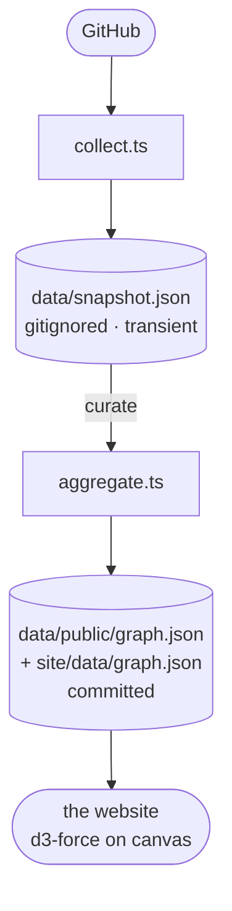

# thank you ✦

A standing thank-you to everyone who ever **starred, forked, watched or followed**
my work — rendered as a *cloud of the people behind the numbers*.

It is deliberately **not** a stats dashboard. No commit graphs, no streaks, no vanity charts.
Every node is a **human** who showed up for something I made, and every line traces their
gesture back to the work it landed on. Fork it, point it at your accounts, and you get your own.


- **Live example:** [thank-you.tamino.dev](https://thank-you.tamino.dev)
- **Sources:** GitHub — every stargazer, forker, watcher, follower, and the open source I depend on
- **Stack:** TypeScript collectors · a nightly GitHub Action · a zero-build static site (d3 on canvas)

---

## Make it your own

You can have your own graph live in about five minutes — no server, no database, free hosting.

1. **Fork** this repo (the green *Fork* button, top-right).

2. **Point it at you** — edit [`config.json`](config.json): set your `owner.name`, `owner.tagline`,
   `sources.github.username`, your `presence` links, and `repoUrl`. That's the only file you need
   to touch — and **no secrets are required**.

3. **Turn on Pages** — **Settings → Pages → Build and deployment → Source: GitHub Actions**.

4. **Run it** — **Actions → Sync & deploy → Run workflow**. It collects your data, publishes the
   curated graph, and deploys.

5. **Done** — your page is live at `https://<your-username>.github.io/<repo>/`, and it refreshes
   itself **every night**.

> *(Optional)* Add a `GH_PAT` secret — a classic token with **no scopes** — for a 5,000/hr API
> rate limit instead of the built-in token's ~1,000/hr. Handy if you have a lot of repos/stars.
>
> Haven't configured anything yet? `npm run serve` already renders the committed sample graph, so
> a fresh fork shows *this* page before you touch a thing.

### Custom domain (optional)

To host at something like `thank-you.tamino.dev`:

1. **DNS** — add a `CNAME` record for your subdomain (`thank-you`) pointing at
   `<your-username>.github.io`. *(An apex domain like `example.com` needs `A`/`ALIAS` records
   instead — see [GitHub's guide](https://docs.github.com/pages/configuring-a-custom-domain-for-your-github-pages-site).)*
2. **config** — set `"cname": "thank-you.example.com"` in [`config.json`](config.json). The deploy
   workflow writes the `CNAME` file from this value, so forks never collide on each other's domain.
3. **GitHub** — **Settings → Pages → Custom domain**, enter the domain, **Save**. Wait for the DNS
   check to pass, then tick **Enforce HTTPS** once the certificate provisions.

Leave `cname` as `null` to stay on the default `github.io` URL.

---

## How it works

A nightly pipeline turns your accounts into one published file:



1. **`collect.ts`** runs every enabled collector and merges them into one people-centric `Snapshot`
   (every raw person + interaction), written to `data/snapshot.json`. It's a **gitignored, transient
   intermediate** — recreated from scratch on every run — so `aggregate` can re-curate (retune
   thresholds, etc.) without re-hitting the APIs.
2. **`aggregate.ts`** distils that snapshot into the **public** graph the site reads
   (`data/public/graph.json`): people ranked by interactions, projects with supporter counts, the
   links between them, and the reciprocal "people & work I lean on" set.
3. **The site** (`site/`) is static — no build step — rendering the graph with
   [d3-force](https://d3js.org) on a `<canvas>`, plus a searchable wall of every supporter.

> *(Heads-up for forkers coming from [`github-stats`](https://github.com/tamino-martinius/github-stats):
> that project encrypts its snapshot to keep private-repo data and incremental history out of the
> public file. This one collects only public data, fully, every night — and the published graph
> already carries every identity — so there's nothing to encrypt. No key, no secret.)*

### What gets collected

> Only data that points back to a **person**. No anonymous aggregates.

| Source | What it reads | People I can thank |
| --- | --- | --- |
| **GitHub** | repos, stargazers (with timestamps), forkers, watchers, followers | ✅ everyone |
| **GitHub (deps)** | every repo's `package.json` → npm → the GitHub repo + maintainer | ✅ maintainers I rely on |

---

## The page

The page is about the **people**, so they carry it: faces are sized up while I and the projects
recede into quiet discs.

- **The cloud** — me at the center, **faces** are super-fans (people who showed up more than
  once), **dots** are everyone else (coral = follows me, warm = starred/forked). Lines are
  coloured by gesture: ★ star · ⑂ fork · 👁 watch · ♥ follow. Drag the cloud, scroll to zoom, hover
  anyone, filter by gesture, or isolate super-fans.
- **The wall** names **everyone**, searchable, with the same hover card as the cloud. The **top
  three amounts** wear gold / silver / bronze podium circles — ties share a circle.
- **I'm grateful too** — the open source I depend on, as star candidates. **Worth a star** =
  still maintained (a push in the last `activeWithinMonths` months) and under `gemMaxStars` stars,
  spanning both my direct deps and their **second-grade** deps ("Two hops away"). It closes with
  a merged list of the people I follow + repos I starred, ranked by reach.
- **Where the love landed** ranks my projects, with GitHub's own **linguist language colours**
  and an archived-repos toggle.

---

## Configuration

Everything tweakable lives in [`config.json`](config.json):

| Key | What it controls |
| --- | --- |
| `owner.name`, `owner.tagline` | your name + the line under the title |
| `sources.<platform>.enabled`, `.username` | which sources run, and the handles |
| `aggregate.superFanThreshold` | interactions needed to earn a face (default 2) |
| `aggregate.gemMaxStars` | the "worth a star" star ceiling (default 1,000) |
| `aggregate.activeWithinMonths` | how recent a push counts as "active" (default 12) |
| `aggregate.maxPeopleInGraph` | cap on people drawn into the cloud |
| `dependencies.includeTransitive`, `.transitiveLimit` | second-grade ("two hops away") deps |
| `presence` | the "where else to find me" links |
| `repoUrl` | the titlebar **GitHub ↗** link |
| `cname` | custom domain (or `null`) |

Change a threshold and re-run `npm run aggregate` — it re-curates from the existing
`data/snapshot.json` without re-collecting.

---

## Local development

```bash
npm install

npm run serve     # → http://localhost:4173  (renders the committed graph; nothing else needed)
npm run sync      # collect + aggregate → refreshes data/snapshot.json + graph.json
```

`collect` needs a GitHub token — it picks up your `gh` CLI login automatically, or set `GH_PAT`
(in a gitignored `.env`, loaded automatically — see `.env.example`). `PORT` overrides the serve port.

| Script | Does |
| --- | --- |
| `npm run collect` | fetch everything → `data/snapshot.json` (needs a GitHub token) |
| `npm run aggregate` | curate → `data/public/graph.json` + `site/data/graph.json` |
| `npm run sync` | both, in order |
| `npm run serve` | preview `site/` locally (no token) |

### Conductor

[`conductor.json`](conductor.json) ships setup (`npm install`) and run
(`PORT="$CONDUCTOR_PORT" npm run serve`, `concurrent`) scripts, and
[`.worktreeinclude`](.worktreeinclude) copies your gitignored `.env` into every new workspace.

---

## Privacy & data

Everything surfaced is already public on the source platforms (GitHub stargazers, followers, etc.).
Only the curated `data/public/graph.json` is committed; the full intermediate `data/snapshot.json`
is gitignored and regenerated each run. Nothing private is collected — `collect` reads only public
endpoints (`/users/<you>/repos`, not your private repos), so there's no secret to manage.

Built with [d3](https://d3js.org) · fonts: Fraunces, Hanken Grotesk, IBM Plex Mono.
Made with gratitude. ✦
